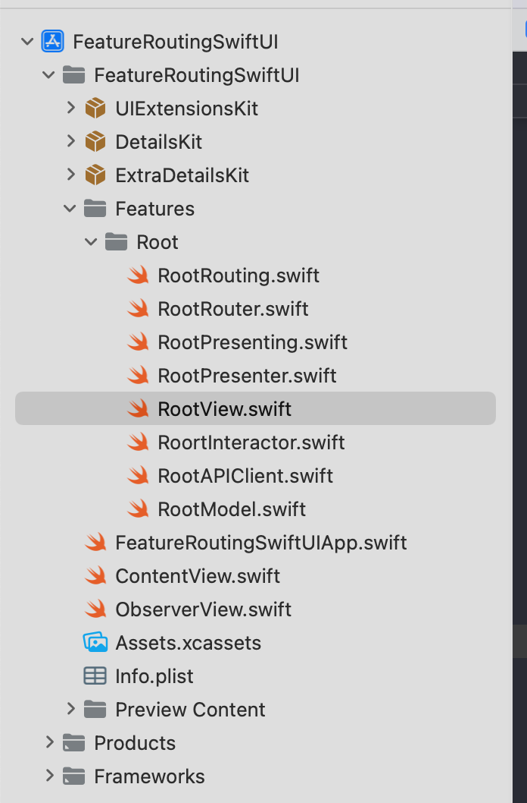
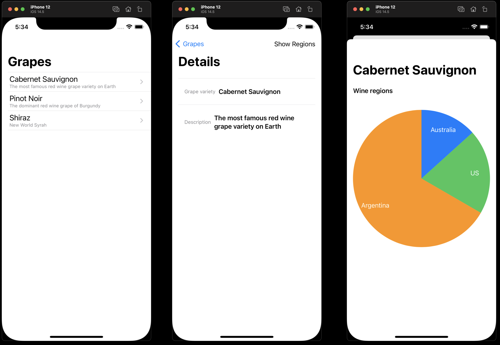

# Routing features with SwiftUI

## Problem statement
This sample code contains a solution to a problem of decoupling navigation from Views written with SwiftUI using VIPER architecture.

### This repo has 2 sample apps in the separate folder:
- /14.5/FeatureRoutingSwiftUI.xcodeproj
- /16/FeatureRoutingSwiftUI.xcodeproj

### Project structure
Each app contains 2 packages  in order to isolate the modules:
- DetailsKit
- ExtraDetailsKit

Which are imported by Root feature with **dynamic presentation** based on the switch in UI.



### iOS 14.5 using [NavigationBackport](https://github.com/johnpatrickmorgan/NavigationBackport)

This package uses the navigation APIs available in older SwiftUI versions (such as `NavigationView` and `NavigationLink`) to recreate the new `NavigationStack` APIs introduced in WWDC22, so that you can start targeting those APIs on older versions of iOS, tvOS and watchOS.

✅ `NavigationStack` -> `NBNavigationStack`
✅ `NavigationLink` -> `NBNavigationLink`
✅ `NavigationPath` -> `NBNavigationPath`
✅ `navigationDestination` -> `nbNavigationDestination`
✅ `NavigationPath.CodableRepresentation` -> `NBNavigationPath.CodableRepresentation`


You can migrate to these APIs now, and when you eventually bump your deployment target to iOS 16, you can remove this library and easily migrate to its SwiftUI equivalent. `NavigationStack`'s full API is replicated, so you can initialise an `NBNavigationStack` with a binding to an `Array`, with a binding to a `NBNavigationPath` binding, or with no binding at all.

### iOS 16 using native iOS navigation [NavigationStack](https://developer.apple.com/documentation/swiftui/navigationstack/)

- [WWDC 2022: The SwiftUI cookbook for navigation](https://developer.apple.com/videos/play/wwdc2022/10054/)

`NavigationStack` allows separating the destination view from the current visible view, by using the .navigationDestination modifier. It's finally a way of doing a clean coordinator.

### Router implementation

Router provides the navigation logic   

```swift
extension RootRouter: RootRouting {
    func makeNavigationView<Label: View>(viewModels: [DataViewModel],
                                          @ViewBuilder label: @escaping (DataViewModel) -> Label) -> AnyView {
        List {
            ForEach(viewModels) { viewModel in
                switch self.presentationStyle {
                case .detailsStack, .extraDetailsStack:
                    NavigationLink(value: viewModel) {
                        label(viewModel)
                    }
                case .detailsModally:
                    label(viewModel)
                        .makeSheet {
                            NavigationView {
                                DetailsView.make(viewModel: viewModel.makeDetailsViewModel(), router: self)
                            }
                        }
                        .anyView
                case .extraDetailsModally:
                    label(viewModel)
                        .makeSheet {
                            NavigationView {
                                ExtraDetailsView.make(viewModel: viewModel.makeExtraDetailsViewModel())
                            }
                        }
                        .anyView
                }
            }
        }
        .navigationDestination(for: DataViewModel.self, destination: { viewModel in
            switch self.presentationStyle {
            case .detailsStack:
                DetailsView.make(viewModel: viewModel.makeDetailsViewModel(), router: self)
            case .extraDetailsStack:
                ExtraDetailsView.make(viewModel: viewModel.makeExtraDetailsViewModel())
            case .detailsModally, .extraDetailsModally:
                fatalError()
            }
        })
        .navigationDestination(for: DetailsKit.DetailsViewModel.self, destination: { viewModel in
            DetailsView.make(viewModel: viewModel, router: self)
        })
        .navigationDestination(for: ExtraDetailsKit.ExtraDetailsViewModel.self, destination: { viewModel in
            ExtraDetailsView.make(viewModel: viewModel)
        })
        .anyView
    }
}
```




## External resources

[Problem statement and discussions could be found here on stackoverflow](https://stackoverflow.com/questions/61304700/swiftui-how-to-avoid-navigation-hardcoded-into-the-view/62909832)
