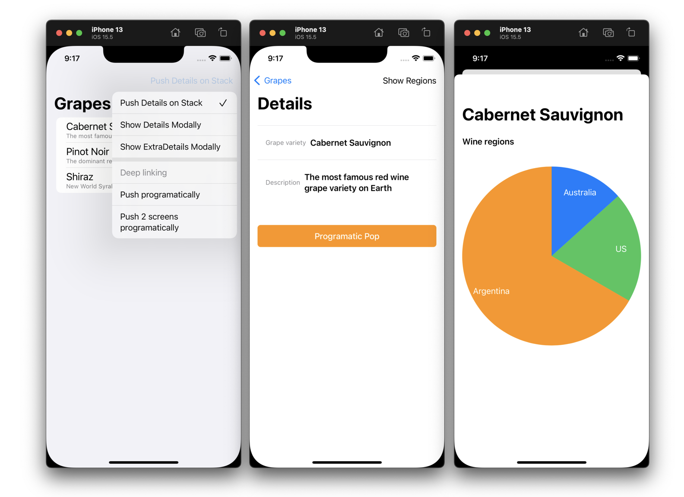

# Routing features with SwiftUI

## Problem statement
This sample code contains a solution to a problem of decoupling navigation from Views written with SwiftUI using VIPER architecture.

### Update June 2022: 
Apple introduced at WWDC the new SwiftUI NavigationStack.

https://developer.apple.com/documentation/swiftui/navigationstack/

[WWDC 2022: The SwiftUI cookbook for navigation](https://developer.apple.com/videos/play/wwdc2022/10054/)

NavigationStack allows separating the destination view from the current visible view, by using the .navigationDestination modifier. It's finally a way of doing a clean coordinator.

Thanks for listening @Apple!

## External resources

[Problem statement and discussions could be found here on stackoverflow](https://stackoverflow.com/questions/61304700/swiftui-how-to-avoid-navigation-hardcoded-into-the-view/62909832)
